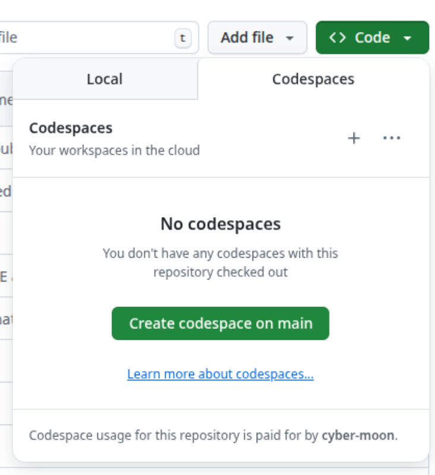

# Build, Publish and Code Quality analysis in CI
This readme helps you to create an CI environment which builds your project, publishes it to Azure Container Registry and executes Code Quality Analsis.

### Prerequisites
- Be part of ipt Sandbox subscription on Azure
- Be part of ipt organisation in Github

### Branches
- **main**: Starting point to solve exercices
- **solution**: Example solution (Musterlösung)

# Setup
1. Create a **public** fork of this Github repo **in your private github namespace** (this is required as we are using the FREE version of SonarCloud later on) \
  a) Note: If the 'fork' button in the repo does not work (e.g. because the iptch repo is currently not public or forking is disabled on organization-level), you can do it manually:
```
# 1. Create an public repository in your personal github namespace
# 2. Execute in your local terminal:
git clone git@github.com:iptch/engineering-fundamentals.git
cd engineering-fundamentals
git remote remove origin
git remote add origin https://github.com/<YourUsername>/<YourRepoName>.git
git push --set-upstream origin main
```
2. Create Codespace (https://github.com/YourUsername/YourRepoName &rarr; Code &rarr; Codespaces) and install the azure cli \

```
# Inside Codespace
pip install azure-cli
```
3. Verification
Check your setup by running the react app in your codespace. You should be able to access the Webapp in your browser.
```bash
nvm install node
npm install
npm run dev
```

## PART A - Unit Test
Tests are vital to ensure that new functionality doesn't break existing features. To ensure that all existing tests are passed when pushing a code change, we want them to be automatically executed when creating a Pull Request.

1. Create a test (e.g. for `src/Counter.tsx`) and execute it by running `npm test`
2. Create a workflow in `.github/workflows` to create a GitHub Action which runs all tests. The action should be executed for every merge request or push to the main branch.

## PART B - Continuous Integration
Fast shipping of new code can be crutial, for example in the case of security updates. We want our code to be automatically packaged into a Docker Image and published to a Container Registry after successfull completion of every Pull Request.

1. Choose your Container Registry. For example, create a personal AzureContainerRegistry in the Azure ipt Sandbox subscription, or a personal space on hub.docker.com.
  a. Store the required credentials in an appropriate place; make sure they are not leaked in your code.
2. Publish your Docker Image to the container registry by creating a new workflow in `.github/workflows`. Ensure that a new appropriate Version Tag is used when publishing the image, and that the image is only pushed upon completion of the PR.
3. If Docker is available on your local machine, you can try to pull your image from the Container Registry and run it locally.

## PART C - Continuous Deployment (Requires Part B)
In this section you are going to create a GitHub Action which runs after the publishing to Azure was successful. 

Prerequisites:
0. Access to ipt Sandbox in Azure
1. Azure Service Plan (Capacity (sku): F1)
2. Azure Web App where the application is deployed
3. Azure Service Principal with the Contributor Role on your Azure Resource Group. Store the secrets in an appropriate place s.t. they can be used by the Github Actions later on.

The following steps work best if you previously completed PART B (automatic publishing to Azure Container Registry). If you haven't completed PART B, you can just manually publish your Image to Azure Container Registry (needs to be created first).

Let's get started: 
1. Create a new workflow for GitHub where you deploy the latest version of your application which you published before to the registry.
2. Test your setup by making a change on the codebase (for example make the logo spin faster) and verify that the change is visible on your deployed webapp.

## PART D - Code Quality
How's the quality of your code? Lets do an automatic assessment!

Use a Github Action (`.github/workflows`) to do an automatic assessment of your Code Quality on [SonarCloud.io](SonarCloud.io). The analysis shall be done for each new Pull Request.
Does SonarCloud point out any issues? Fix them.

## PART E - Security (Requires Part B)
In Part B, when publishing your image to Azure Container Registry, you probably used Admin Credentials. Extend your setup to use a more secure option for authentication.

## PART F - GitOps (Requires Part B)
ArgoCD is a heavy used tool to enable gitops. It monitors your github repository and applies the configuration to the configured namespace.

Deploy an AKS cluster and install ArgoCD on it. Then configure ArgoCD to monitor your github repository and apply the configuration to the configured namespace.


## PART G - Dependency Management

### Manage Dependencies
Dependency management is a crucial part of software development. It helps you to keep your dependencies up to date and secure. 

There are multiple tools and technologies to manage dependencies. Check which tool or technology fits best for your project and your needs. Take into account that this solution should be used in enterprise environments with multiple developers and multiple projects.

Add a workflow to your project to automatically update dependencies.

Be careful with permissions and tokens...

## PART H - AI Code Review

Add the capability to your project to automatically review code changes using AI.
 
There are different possibilities to achieve this. For example there are different AI providers and different ways to integrate them into your project. List the advantages and disadvantages of the different approaches and choose the one that best suits your needs.

PS: Keep the trivy incident in mind ;-) 
